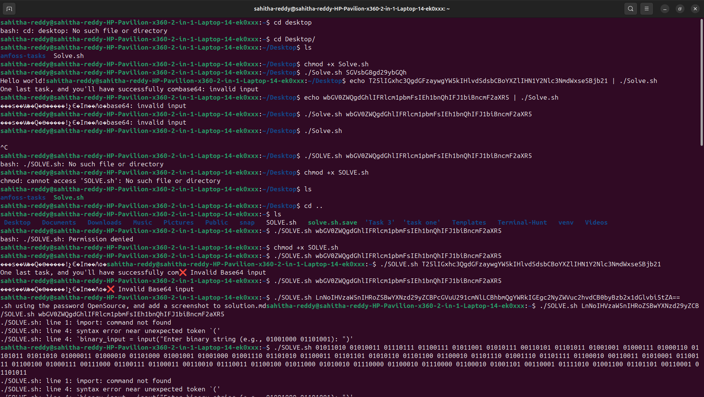

# amFoss Praveshan 2025 - Terminal Hunt Reprt
## Introduction 
I attempted the Terminal Hunt as a part of am Foss Praveshan 2025.
This report contains the screen shots of it
##Find the facility
###The only way to survive this apocalypse is by leaving Earth and reaching for the stars. There's a facility hidden somewhere on Earth that is trying to find a way to survive. Find it and get the first piece of the puzzle (the gravity equation) to escape Earth

##Enter the wormhole
###You've found all you need to in Earth. Now it's time to leave Earth and go to Gargantua. To do so though, first you have to go to the wormhole near Saturn's ring but it warps the space around it and is very difficult to find. The wormhole is hidden so you'll have to find it, make it executable and then go through it to get your second key. Now you can move back to root and then go to the Gargantua System

##Enter Garganutua system

##Analyze planets in the new system - I have searched almost every thing so I will kepp all the screen shots of it.
###It's time to enter your new stellar system by changing branches. Now that your finally in gargantua explore the plantes and find one that's compatible with us. It must be screaming that it's habitable to us, must be smaller than 105 and must also be bigger than 100 or else it won't last and will only be a temporary sanctuary. Beware, for it won't be easy to find.

##Gargantua
###U have found the planet which is habitable. Now you must get the message to Earth in time for them to leave and survive. Enter the blackhole Gargantua and find the message from Them. Now make a solve.sh file and script it so that it takes a string as input and then decodes the given string from base-b4. Finally, give the clues you've found so far to the script file 

##running gravity

## clues decoded -there was some problem with my code so for some i usea chatgpt to decode it

